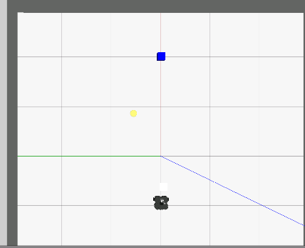

# ROS2 Autonomous Warehouse Robot (Perception + Manipulation)

## Overview

This project presents an autonomous mobile robot system developed using ROS for smart warehouse automation.

The robot is capable of detecting, picking, transporting, and placing objects within a simulated warehouse environment. The system integrates computer vision, control, and robotic manipulation into a complete end-to-end pipeline.

---

## Problem Statement

Warehouse operations are often slow, repetitive, and labour-intensive, leading to inefficiencies and increased costs.

This project demonstrates how autonomous mobile robots can improve logistics efficiency by performing object handling tasks without human intervention, aligning with Industry 4.0 automation goals.

---

## System Architecture

### Robot Platform

* TurtleBot3 Waffle mobile robot (ROS-compatible)
* Custom-designed robotic arm (URDF-based)
* Suction gripper for object manipulation

### Core Technologies

* ROS (rospy)
* OpenCV (image processing)
* Gazebo (simulation)
* URDF (robot modelling)

---

## System Workflow

1. Capture image from robot camera
2. Detect blue object using HSV colour filtering
3. Navigate towards object using velocity control
4. Activate robotic arm to pick up object
5. Transport object to predefined drop-off location
6. Release object and complete task

---

## Key Features

* Real-time object detection using OpenCV (HSV filtering)
* Autonomous navigation using `/cmd_vel`
* Custom robotic arm with PID control
* Full pick-and-place pipeline implementation
* Gazebo-based simulation environment

---

## Core Implementation

### Object Detection

* HSV colour space filtering used to detect blue objects
* Pixel thresholding ensures reliable object recognition
* Detection validated using pixel count and distance constraints

### Control System

* Linear velocity control for navigation (`/cmd_vel`)
* Arm control via position commands (`/arm_controller/command`)
* PID control defined in `controllers.yaml`

### Robot Modelling

* Custom URDF including:

  * Revolute arm joint
  * Suction pad end-effector
  * Additional structural components
* Gazebo plugins:

  * Differential drive controller
  * ROS control interface

---

## Simulation Environment

* Custom warehouse world (`warehouse.world`)
* Object model (`blue_cube.sdf`)
* Robot and environment launched using ROS launch file

---

## Results

* Successful detection of target object
* Smooth navigation towards object
* Reliable object pick-up using robotic arm
* Accurate transport and drop-off
* Full autonomous task execution

---

## Challenges & Solutions

| Challenge               | Solution                                  |
| ----------------------- | ----------------------------------------- |
| Noisy colour detection  | Tuned HSV thresholds                      |
| Pick-up inconsistency   | Added pixel-drop validation logic         |
| Navigation inaccuracies | Adjusted velocity and stopping conditions |

---

## Simulation Results

### Warehouse Environment

### Robot with Custom Arm

### Object Detection & Approach

### Pick-up Phase

### Transport & Drop-off

---

## Demo

See demo video in:
`media/demo.mp4`

---

## Future Improvements

* Replace colour detection with QR/barcode recognition
* Improve navigation using SLAM/Nav2
* Add obstacle avoidance
* Deploy system on real robotic hardware

---

## Technologies Used

* ROS (Robot Operating System)
* Python
* OpenCV
* Gazebo
* URDF

---

## Author

Jessica Sutherns
